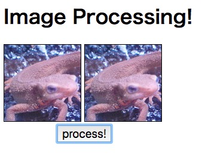

# Tutorial -Python-

Pythonでやりたい人はこっち〜〜
>> https://github.com/yoyoyo-yo/Gasyori100knock/blob/master/Tutorial/README.md


C++でやりたい人はこっち〜〜 
>> https://github.com/yoyoyo-yo/Gasyori100knock/blob/master/Tutorial/README_opencv_c_install.md

ここではJavascriptを用いた画像処理を紹介していきます。

## 環境設定

### 1. サーバーの準備

まずはサーバー化する準備をしていきます。難しいことはなにもありません。

Macではまず、brewを使ってnodebrewというものをインストールします。以下のコマンドを準におこなってください。
を参考しています。

```bash
$ brew install nodebrew
$ mkdir -p ~/.nodebrew/src
$ nodebrew install-binary latest
$ nodebrew list
$ nodebrew v10.10.0
$ nodebrew use stabke
$ npm install -g live-server
```

ここまでやったら、.bash_profileを開いて、下記を追記します。

```bash
export PATH=$PATH:/Users/[user]/.nodebrew/current/bin

if [-f ~/.bashrc ]; then
    . ~/.bashrc
fi
```

追記したら、下記コマンドでbash_profileの変更をターミナルに反映させます。

```bash
$ source ~/.bash_profile
```

ここまでしたら、下記コマンドで、ちゃんとバージョンが表示されるか確かめます。

```bash
$ node -v
v12.3.1
$
$ npm -v
6.9.0
```

### 2. サンプルプログラム

このディレクトリにあるsample.htmlがあることを確認してください。

### 3. サーバー立ち上げして、画像処理

このコマンドで勝手にサーバーが立ち上がって、chromeやらなんやらのページが勝手に開きます。
なので、sample.htmlを指定してください。

```bash
$ live-server ./
```

### 4. 動作確認

Processボタンを押して、右側に画像がちゃんと表示されるか確かめてください。
表示されればおｋです。ちなみにサーバーを動かさないと、画像が表示されません。

| ブラウザに表示時 | ボタンを押したら |
|:---:|:---:|
|  |  |


## 画像処理


次にJSで画像処理する方法を説明していきます。（もう知ってるという人はスキップして問題に進んで下さい！）
JSではimageData()というものを使用して、画像処理を行っていきます。

## 画像読み込み、表示

まず、bodyタグ内に canvasタグを入れます。

```html
<body>
  <canvas id="canvas" style="border: solid thin black;"></canvas>
</body>
```

次に、bodyタグないのscriptタグに画像処理を書いていきます。head内のscript内に書いても何故か反映されないので、注意してください。

```html
<script>
let image = new Image();
image.src = "imori.jpg";
const canvas = document.getElementById("canvas");
const ctx = canvas.getElementById("2d");

image.onload = () => {
  canvas.width = image.width;
  canvas.height = image.height;
  
  ctx.drawImage(image, 0, 0, canvas.width, canvas,height);
  
  let src = ctx.getImageData(0, 0, image.width, image.height);
}
</script>
```

これで変数srcにImageDataという形式で画像データが格納されます。これは一度canvasに描画した画像をgetImageData()という関数で読み込むことで、画像処理を扱える形式に変換しています。

画像のサイズ情報をとるにはsrc.data.lengthを使います。
これは(高さ✕横✕チャネル)の順になっていて、今回は65536、つまり 縦128ピクセル、横128ピクセル、3チャネル(青、緑、赤)を意味します。

```html
alert(src.data.length)
# これでダイアログ形式で表示されます。
```

画像の表示はcreateImageDataという関数を使います。canvasをもう一つ用意し、同様にcanvasをgetContextします。
そしたら、putImageData()を用いて画像データを描画するようにします。

```html
<body>
  <canvas id="canvas" style="border: solid thin black;"></canvas>
  <canvas id="canvas_result"  style="border: solid thin black;"></canvas>

  <br>
  <button onclick="process();" style="margin-left: 90px; font-size: 20px;">process!</button>

  <script type="text/javascript">
    let image = new Image();
    var src = "imori.jpg";
    image.src = src;
    const canvas = document.getElementById("canvas");
    const ctx = canvas.getContext("2d");
    const canvas_result = document.getElementById("canvas_result");
    const ctx_result = canvas_result.getContext("2d");
    image.onload = () => {
        canvas.width = image.width;
        canvas.height = image.height;
        
        ctx.drawImage(image, 0, 0, canvas.width, canvas.height);

        canvas_result.width = image.width;
        canvas_result.height = image.height;
    }

    function process(){

        let src = ctx.getImageData(0, 0, image.width, image.height);

        ctx_result.putImageData(src, 0, 0);
    }
    
    </script>
 
```


## 画素をいじる。

画素の操作はpythonなどと変わりません。dstには配列形式で画像データが格納されています。
ただし、pythonなどと違うことは画像画像データが全て１列の配列になっていることです。

順番としては、インデックス0から3にはx=1,y=1のR値、G値、B値、アルファ値（透明度）、次の4から7には、x=2,y=1のR，G,B,アルファというように格納されています。

例えば、x=30、y=20の画素値を赤にしたい時は、こうします。
要素のインデックスは計算する必要があるので注意して下さい。

```html
function process(){
  let src = ctx.getImageData(0, 0, image.width, image.height);

  // R
  src.data[29 * 4 + 19 * 128 * 4] = 255;
  // G
  src.data[29 * 4 + 19 * 128 * 4 + 1] = 0;
  // B
  src.data[29 * 4 + 19 * 128 * 4 + 2] = 0;

  ctx_result.putImageData(src, 0, 0);
}
```


## 画像のコピー

画像を別変数にコピーしたい時は新しいcanvasの方で、

```html
let dst = ctx_result.createImageData(image.width, image.height);
```

として、画像のコピー先の変数を用意します。そして、

```html
let src = ctx.getImageData(0, 0, image.width, image.height);
let dst = ctx_result.createImageData(image.width, image.height);

for (let i = 0; i < src.data.length; i+= 4){
  dst.data[i] = src.data[i];
  dst.data[i+1] = src.data[i+1];
  dst.data[i+2] = src.data[i+2];
  dst.data[i+3] = src.data[i+3];
}
ctx_result.putImageData(dst, 0, 0);
```

というように、各要素の値を代入することで、コピーが得られます。


## 画像の保存

??

## 練習

画像の左半分上のRとBを入れ替えて表示してみましょう。


回答例
 
```bash
>>> import cv2
>>> img = cv2.imread("imori.jpg")
>>> img3 = img.copy()
>>> H, W, C = img3.shape
>>> img3[:H//2, :W//2] = img3[:H//2, :W//2, (2, 1, 0)]
>>> cv2.imshow('', img3); cv2.waitKey(0)
102
>>> 
```

以上でチュートリアルは終了です。

あとはばんばん問題を解いて下さい！！！！
